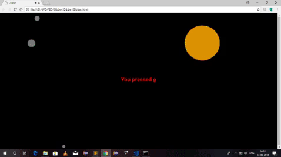

# Gibber

Here I have used paper.js for animation purpose.

When the user press any key from a to z, a random circle appears on the screen and shrinks as the time goes. As the user presses a key there is also a sonud played on the back ground.

Here is a working sample of the application:

